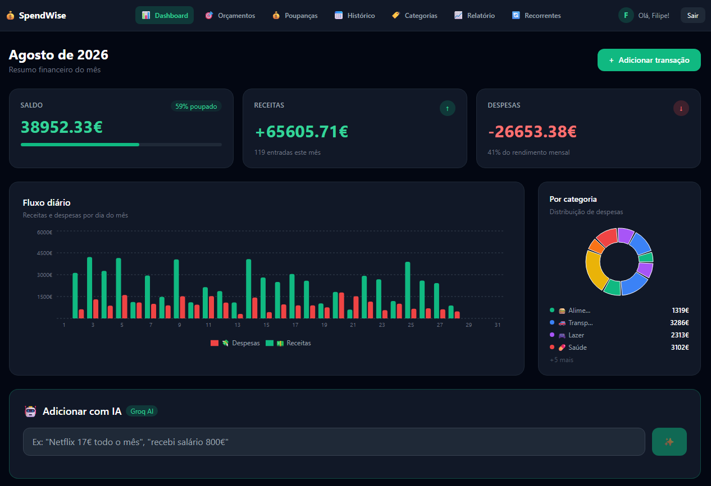
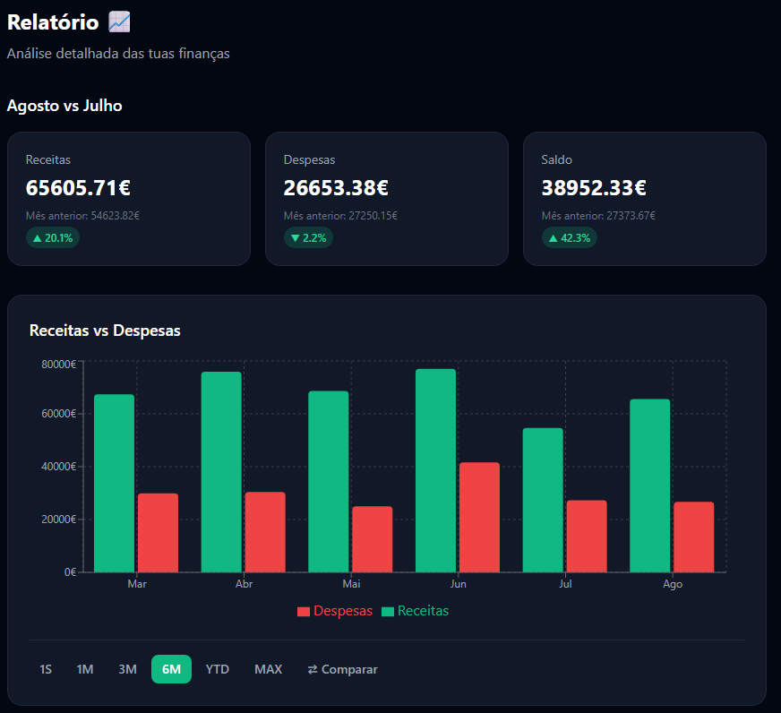
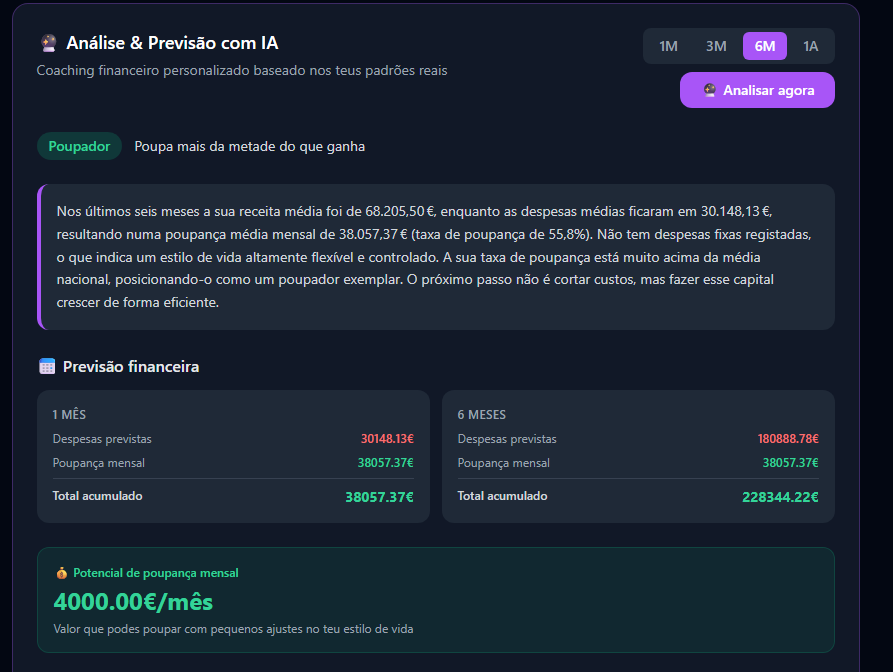

# Spendrax


A full-stack personal finance application built with FastAPI and React. Users track income and expenses, set budgets and savings goals, and enter transactions in plain language — an LLM parses the input and creates the right entries.

This started as a portfolio project and has since been used as a testbed for backend engineering practices: caching, rate limiting, database migrations and CI.



---

## Features

- **Dashboard** — monthly income, expenses and balance, with daily flow and category breakdown
- **Transactions** — full CRUD, scoped per user, with monthly and multi-month aggregations
- **Recurring transactions** — fixed income and expenses (salary, rent) flagged and tracked separately
- **AI transaction parsing** — natural-language input ("Netflix 17€ every month") is parsed into a structured transaction, including recurrence detection
- **AI financial report** — generates a savings profile, forecasts and actionable recommendations from the user's actual history
- **Budgets and savings goals** with progress tracking
- **JWT authentication** — every query is scoped to the authenticated user





---

## Tech Stack

**Backend** — FastAPI, SQLAlchemy, PostgreSQL, Redis, Alembic  
**Frontend** — React, TypeScript, Tailwind CSS, Recharts  
**AI** — Groq API (GPT-OSS 120B)  
**Infrastructure** — Docker Compose, GitHub Actions

---

## Engineering notes

The parts of this project worth reading the code for.

### Redis caching layer

Dashboard aggregations run `SUM` and `GROUP BY` over the full transaction history. These are read-heavy, repeated on every page load, and change only when the user writes.

Results are cached in Redis with a 5-minute TTL. Keys are namespaced per user (`user:{id}:summary:{year}-{month}`), which is the critical detail — without the user ID in the key, one user would be served another's financial data.

Measured on a 86,000-transaction dataset, 30 requests per scenario, median:

| Endpoint | Without cache | With cache | Improvement |
|---|---|---|---|
| Monthly summary | 28.4 ms | 5.9 ms | 79% |
| 24-month history | 103.0 ms | 7.4 ms | 93% |

The heavier endpoint gains more, which is what you would expect — the cache saves whatever work it replaces. The ~6 ms floor is HTTP overhead, JSON serialisation and JWT validation, none of which caching removes.

Reproduce with `benchmark.py`.

**Invalidation.** Writes call `invalidate_user()`, which drops every cached key for that user via `SCAN` — not `KEYS`, which blocks the entire Redis instance while it walks the keyspace. Invalidation is deliberately coarse: editing a transaction can change its date and affect two different months, so calculating exactly which keys to drop would be more efficient and much easier to get wrong. Serving stale data is worse than serving slower data.

**Failure mode.** Every cache operation is wrapped in a try/except that swallows the error. If Redis goes down, `cache_get` returns `None`, the route treats it as a miss and falls through to PostgreSQL. The app gets slower, not broken.

### Rate limiting

The AI endpoints call an external API with per-token cost and a shared organisation-level quota. Both are rate limited per user with `INCR` + `EXPIRE` on a fixed time window:

- `/api/ai/parse` — 10 requests/minute (~800 tokens each)
- `/api/ai/report` — 3 requests/minute (~4000 tokens each)

Different limits for different costs. Three users generating reports concurrently would otherwise exhaust the upstream quota.

This is a fixed window, not a sliding one: a user can send 10 requests at 0:59 and 10 more at 1:01. A sliding window using a sorted set would close that gap. The simpler approach was chosen deliberately and the limitation is known.

On Redis failure the limiter fails **open** — requests are allowed through. This trades cost control for availability. Fail-closed is equally defensible; the choice is documented in a test so that changing it is a deliberate act.

### API key handling

Both AI features originally called Groq directly from the browser with the key exposed via `import.meta.env.VITE_GROQ_API_KEY`, which Vite inlines into the shipped bundle. Anyone opening DevTools had the key.

The integration was moved server-side. The frontend now posts to `/api/ai/parse` and `/api/ai/report`; prompts, keys and the upstream call all live on the server. Two side effects worth noting:

- The report endpoint previously received pre-computed averages from the client. It now queries them from the database, so a client can no longer influence the analysis by lying about its own numbers.
- Changing the LLM became a config change rather than a frontend rebuild — which mattered when Groq deprecated `llama-3.3-70b-versatile` mid-project and the integration silently broke.

LLM output is validated before use: the model can and does return out-of-range enum values, negative amounts and categories that don't exist.

### Database migrations

The schema was originally created by `Base.metadata.create_all()`, which creates missing tables and nothing else — it cannot alter existing ones, and leaves no record of what changed.

Alembic now manages the schema. The first revision is an intentionally empty baseline, applied with `stamp` rather than `upgrade`, since the schema already existed when migrations were introduced.

Introducing Alembic surfaced a real problem: five indexes existed in the database but not in the models, having been applied by hand. Autogenerate proposed dropping them. They are now declared in `models.py` — including a partial index on recurring transactions and a composite `(user_id, date DESC)` index that serves the dashboard's dominant access pattern.

### Tests

14 unit tests covering the cache layer and rate limiter, run against a real Redis instance on database 15 to keep them isolated from development data.

The two that matter most verify **user isolation**: that invalidating one user's cache leaves another's intact, and that one user exhausting their rate limit doesn't affect anyone else. Both would pass silently if the user ID were dropped from the key — and the application would keep working while leaking data between accounts.

Two more simulate a dead Redis to verify the app degrades rather than fails.

These are unit tests of the caching layer, not integration tests of the API. Route-level tests would need a test database and dependency overrides — see Next steps.

### CI

GitHub Actions runs the test suite on every push, on a clean runner with a Redis service container.

---

## Running locally

**Prerequisites:** Docker, Python 3.12+, Node.js 18+

```bash
git clone https://github.com/Filipe1507/Spendrax.git
cd Spendrax
```

**1. Start infrastructure**

```bash
docker compose up -d
```

Brings up PostgreSQL (port 5433) and Redis (port 6379).

**2. Configure environment**

Copy `.env.example` to `.env` and fill in the values. A Groq API key is available free at [console.groq.com](https://console.groq.com).

**3. Backend**

```bash
python -m venv venv
venv\Scripts\Activate.ps1        # Windows
source venv/bin/activate         # macOS / Linux

pip install -r requirements.txt
alembic upgrade head
uvicorn main:app --reload
```

API at `http://127.0.0.1:8000`, interactive docs at `/docs`.

**4. Frontend**

```bash
cd frontend
npm install
npm run dev
```

**Optional:** `python seed_data.py` generates test transactions; `python benchmark.py` reproduces the cache measurements.

---

## Next steps

- **Pagination** on the transaction list — currently returns a full month in one response (~186 kB with a dense dataset). A volume problem that caching does not solve.
- **Route-level integration tests** using FastAPI's `TestClient` against a dedicated test database.
- **Async report generation** — the AI report blocks an HTTP request for several seconds with no retry on upstream failure. A genuine candidate for a job queue.

---

## Author

Filipe Ferreira — [LinkedIn](https://www.linkedin.com/in/filipe-ferreira-67972b35a)